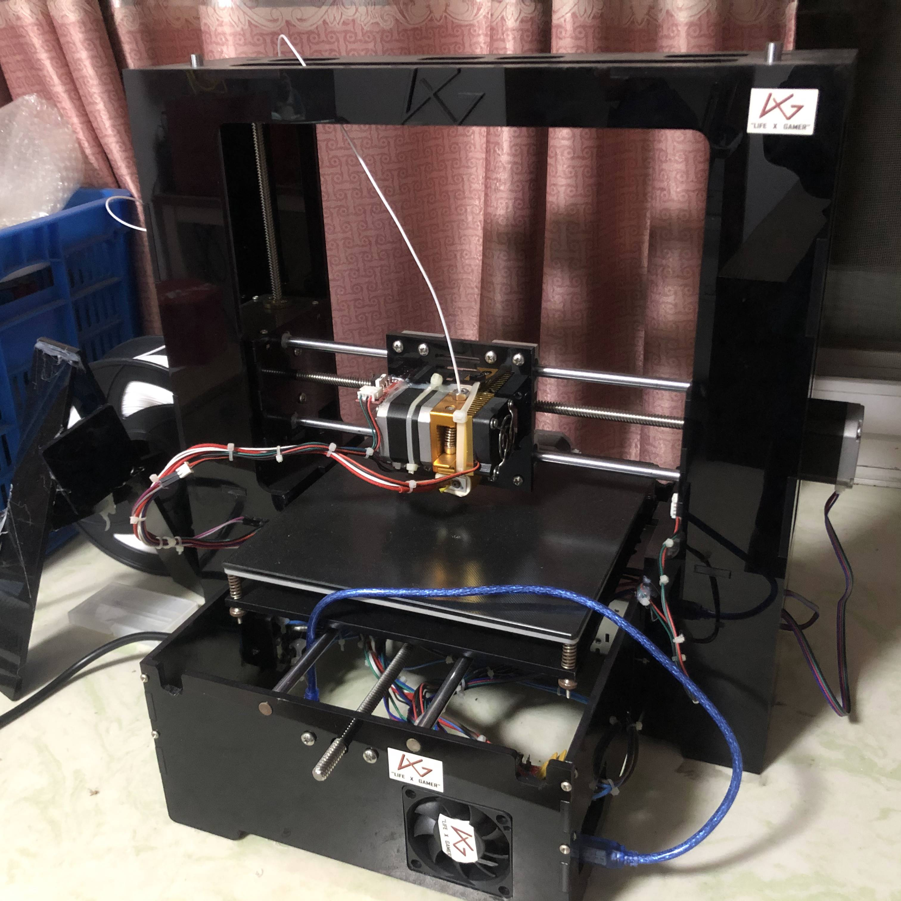

# exArtist_3D打印机

开源至Github:[点我传送](https://github.com/firestaradmin/exArtist_3DPrinter)

## 简介

exArtist_3D打印机基于arduino主控制作的第二款，Artist系列作品。

主控用的是arduino官方开发板，软件使用Marlin固件。

机械部分设计，是使用solidworks设计的。

此作品为测试，和兴趣。初学建模、单片机，水平有限。

### 靓照：

